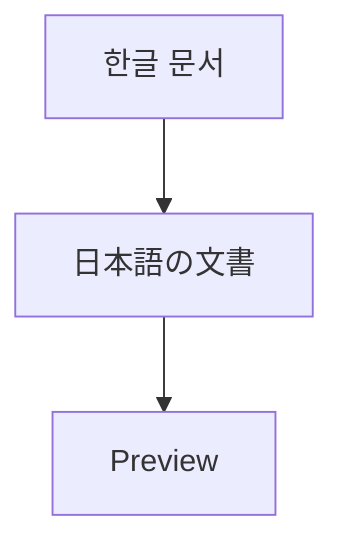

# Second document

Relative Markdown navigation works without a browser.

## 돌아가기

Press **b** or Backspace to return to the previous position.

[Back to the demo](demo.md#reading-tools)

```mermaid
flowchart TD
    A[한글 문서] --> B[日本語の文書]
    B --> C[Preview]
```
